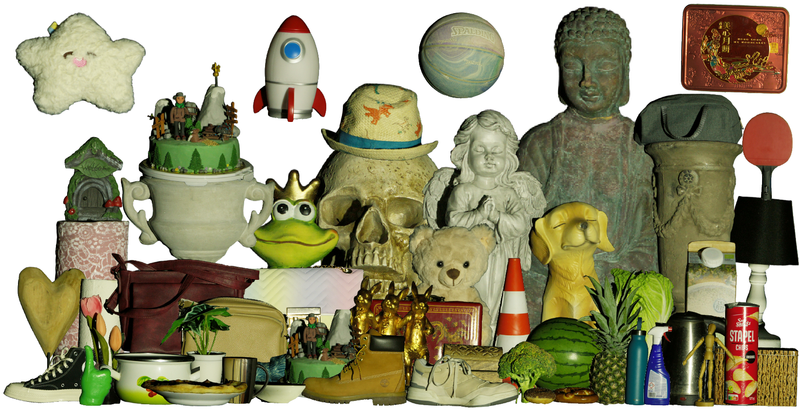

# OLATverse: A Large-Scale Real-World Object Dataset with Precise Lighting Control
<h2 style="font-size: 1.7em;">CVPR 2026 (<span style="color:#e05c2a">Oral</span>)</h2>

[🌐 Project Page](https://vcai.mpi-inf.mpg.de/projects/OLATverse/) | [📦 Dataset](https://gvv-assets.mpi-inf.mpg.de/OLATverse/) | [📊 Preview Excel](assets/preview.xlsx)




---

## 1. Dataset Download

For user convenience, we release the **processed** OLATverse at the [dataset link](https://gvv-assets.mpi-inf.mpg.de/OLATverse/). Users need to register an account and request access to the dataset. The dataset consists of:

- **OLATverse_Tr** — the full training set containing **767 objects**, split into 11 archives (`OLATverse_Tr0001-0070.tar.gz`, ..., `OLATverse_Tr0701-0767.tar.gz`), each containing approximately 70 objects.
- **OLATverse_Val** — a curated validation set containing **42** carefully selected, high-quality, and diverse objects..

An offline Excel for all object preview is available at [excel link](assets/preview.xlsx). It includes the capture date, object ID, category label, LVIS category, and material types (up to 2 per object). The final object ID used across OLATverse follows this format: `data-{date}-{objectID}`

To reduce storage and improve visualization, all captured images are processed as follows:
- Downsampled to **1500 × 2844** resolution
- Brightness adjusted by scale of 2.0 for better visualization
- Converted to sRGB and stored as **AVIF**
- Background masked out
- Auxiliary data including masks, pseudo-GT normals, and diffuse albedo are also provided.

---

## 2. Data Structure

### 2.1 OLATverse_Tr

The structure of each object folder is as follows:

```
data-{date}-{objID}/
├── masked_olat/                                        # 35 camera views, background removed
│   ├── Cam01/    xxx.000000.avif - xxx.000362.avif     # 363 AVIF images per camera
│   ├── Cam02/
│   └── ...
├── mask/                                               # Foreground masks for 35 views
│   ├── Cam01.png
│   ├── Cam02.png
│   └── ...
├── pbr/                                                # Extracted normals and albedo (see below)
└── all_cam.json                                        # Camera matrices at resolution 1500 × 2844
```

#### ▸ masked_olat

Each camera folder contains **363 AVIF images** with the following structure:

| File | Description |
|------|-------------|
| `xxx.000000` and `xxx.000014` | Full-bright (FB) captures |
| `xxx.000001` – `xxx.000013` | Predefined environmental illuminations |
| `xxx.000015` – `xxx.000362` | Interleaved OLAT + FB sequence |

> **Note:** The OLAT + full-bright (FB) sequences are interleaved in capture setup. The detailed sequence is documented in `shared/all_lights.json` (see below).

#### ▸ all_cam.json

Calibrated camera for each object:

| Field | Description |
|-------|-------------|
| `cam_idx` | Camera ID |
| `transform_matrix` | Extrinsic matrix |
| `camera_intrinsics` | Intrinsic matrix |

#### ▸ pbr/

Extracted pseudo-GT normal/albedo for each object:

| File | Description |
|------|-------------|
| `{CamID}_ncg.png` | Normals obtained from color-gradient illumination from all cameras |
| `{CamID}_diff.png` | Diffuse albedo derived from 5 polarized views |
| `{CamID}_nd.png` | Diffuse normals derived from 5 polarized views |

> **Note:** Normals `{CamID}_nd.png` extracted from five polarized views appears to be more accuate than normals obtained via color-gradient illumination.

---

### 2.2 OLATverse_Val

The validation set contains all data from OLATverse_Tr, plus additional files for benchmarking:

```
data-{date}-{objID}/
├── masked_olat/              # Same as OLATverse_Tr
├── mask/                     # Same as OLATverse_Tr
├── pbr/                      # Same as OLATverse_Tr
├── all_cam.json              # Same as OLATverse_Tr
├── model/                    # Reconstructed mesh (Metashape)
├── normal_benchmark/         # Normal maps used for benchmarking in the paper
│   ├── gt_normal/            # 5 processed GT normals aligned to corresponding camera views
│   ├── input/ - input3/      # 5 input images under different illuminations
│   └── mask/                 # Masks for the 5 benchmark views
├── transforms_train.json     # Transform file used for normal benchmarking in the paper
└── transforms_test.json      # Transform file used for normal benchmarking in the paper
```

#### ▸ transforms_train.json / transforms_test.json

Train and validation cameras/lights utilized in our benchmarking in the paper

| Field | Description |
|-------|-------------|
| `file_ext` | Image file extension |
| `file_path` | Path to the input image |
| `light_idx` | Light ID |
| `cam_idx` | Camera ID |
| `transform_matrix` | Extrinsic matrix |
| `camera_intrinsics` | Intrinsic matrix |
| `pl_intensity` | Hard-coded light intensity |
| `pl_pos` | Light position |

---

## 3. Camera and Light Setup

### 3.1 Cameras

Each object is captured from **35 camera views** distributed across four layers of the light stage dome, from top to bottom. Five cameras (Cam07, Cam10, Cam17, Cam22, Cam39) are equipped with linear polarization filters, so images from these cameras typically appear darker than those from the remaining 30 regular cameras.


| Layer | Cameras |
|-------|---------|
| Layer 1 (Top) | Cam24, Cam26, Cam29, Cam36, Cam40 |
| Layer 2 | Cam01, Cam05, Cam15, Cam18, Cam20, Cam22*, Cam27, Cam30, Cam31, Cam35, Cam37, Cam38 |
| Layer 3 | Cam03, Cam06, Cam07*, Cam09, Cam10*, Cam11, Cam12, Cam14, Cam17*, Cam19, Cam39* |
| Layer 4 (Bottom) | Cam02, Cam04, Cam08, Cam13, Cam16, Cam23, Cam32 |

> **Note:** Cameras marked with * are equipped with linear polarization filters.

### 3.2 Lights

Our setup contains **331 individually controlled lights**. Lighting information is shared across all the objects, and provided in the `shared/` folder:

| File | Description |
|------|-------------|
| `envmap_zspiral_mpi/` | Environment map masks for each OLAT image (see correspondence table below) |
| `all_lights.json` | Extracted 3D positions of individual lights |
| `LSX_light_positions_aligned.pc` *(metadata)* | Raw 3D light source positions |
| `LSX3_light_z_spiral.txt` *(metadata)* | Raw correspondence between capture-ordered ID and light ID |
| `z_spiral.mp4` *(metadata)* | Video visualisation of environment map masks |

> **Note:** Pure black images in `envmap_zspiral_mpi/` correspond to full-bright (FB) captures. The **light IDs in the raw metadata do not correspond to `light_idx` in `all_lights.json`**.

#### ▸ all_lights.json

331 lighting information shared across all objects:

| Field | Description |
|-------|-------------|
| `file_path` | Path to the OLAT image under the corresponding light (e.g. `obj_id.000015` ↔ `light_idx` 0, ..., `obj_id.000361` ↔ `light_idx` 330) |
| `light_idx` | Light ID (0 – 330) |
| `pl_intensity` | Hard-coded light intensity |
| `pl_pos` | Light position |

#### ▸ Lighting Correspondence

The table below shows example correspondences between `masked_olat/`, `all_lights.json`, and `envmap_zspiral_mpi/`:

| `masked_olat` | `all_lights.json` | `envmap_zspiral_mpi` |
|---------------|-------------------|----------------------|
| `obj_id.000014` (FB) | — | `000.png` |
| `obj_id.000015` | `light_idx` 0 | `001.png` |
| `obj_id.000016` | `light_idx` 1 | `002.png` |
| `obj_id.000034` (FB) | — | `020.png` |
| `obj_id.000035` | `light_idx` 19 | `021.png` |
| `obj_id.000036` | `light_idx` 20 | `022.png` |
| `obj_id.000360` | `light_idx` 329 | `346.png` |
| `obj_id.000361` | `light_idx` 330 | `347.png` |
| `obj_id.000362` (FB) | — | `348.png` |

---

## 4. Relighting

We provide relighting code to render 360° rotation videos for OLATverse subjects under various environment maps. See [`relighting/README.md`](relighting/README.md) for setup and usage instructions.

---

Due to large storage costs, it is difficult to release RAW HDR images for the full dataset. If you have any questions, suggestions, or requests for RAW linear EXR data of several objects, please contact xzhou@mpi-inf.mpg.de.

---

## Citation

If you find our dataset helpful, please consider citing our work:

```bibtex
@inproceedings{zhou2026olatverse,
  title={OLATverse: A Large-scale Real-world Object Dataset with Precise Lighting Control},
  author={Zhou, Xilong and Chen, Jianchun and Rao, Pramod and Teufel, Timo and Lyu, Linjie and Minasian, Tigran and Sotnychenko, Oleksandr and Long, Xiao-Xiao and Habermann, Marc and Theobalt, Christian},
  booktitle={Proceedings of the IEEE/CVF Conference on Computer Vision and Pattern Recognition},
  pages={28848--28859},
  year={2026}
}
```